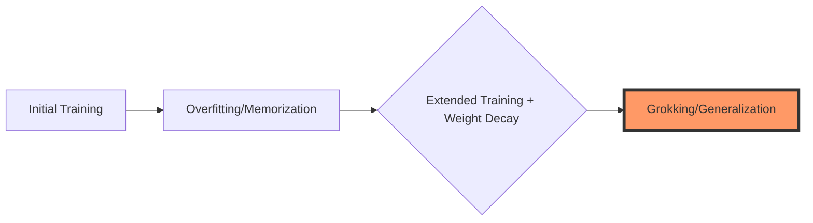
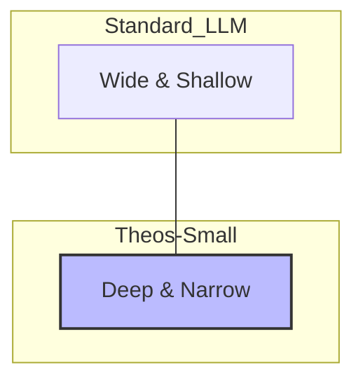

# Architecting Emergent Reasoning in Data-Constrained Regimes

## A Comprehensive Framework for Training Small Language Models on Monolithic Theological Corpora via Torchtitan

---

## Table of Contents
1.  [Executive Summary](#1-executive-summary)
2.  [Theoretical Foundations: Reasoning in the Absence of Scale](#2-theoretical-foundations-reasoning-in-the-absence-of-scale)
    *   [2.1 The Limits of Scaling Laws and the Grokking Hypothesis](#21-the-limits-of-scaling-laws-and-the-grokking-hypothesis)
    *   [2.2 Semantic Density and the TinyStories Paradigm](#22-semantic-density-and-the-tinystories-paradigm)
    *   [2.3 Information-Theoretic Implications](#23-information-theoretic-implications-of-monolithic-corpora)
3.  [Architecting with Torchtitan: The "Theos-Small" Model](#3-architecting-with-torchtitan-the-theos-small-model)
    *   [3.1 Composable Design](#31-torchtitans-composable-design-and-applicability)
    *   [3.2 The "Deep & Narrow" Topology](#32-the-deep--narrow-topology)
    *   [3.3 Stabilization via DeepNorm](#33-stabilization-via-deepnorm)
    *   [3.4 Customizing the Training Loop](#34-customizing-the-training-loop-with-model_converter)
4.  [Data Curation and Tokenization Engineering](#4-data-curation-and-tokenization-engineering)
    *   [4.1 Tokenization Strategy: Compressing Theology](#41-tokenization-strategy-compressing-theology)
    *   [4.2 Dataset Augmentation for Reasoning](#42-dataset-augmentation-for-reasoning)
5.  [The Training Regime: Inducing Phase Transitions](#5-the-training-regime-inducing-phase-transitions)
    *   [5.1 Optimization Dynamics and Hyperparameters](#51-optimization-dynamics-and-hyperparameters)
    *   [5.2 Leveraging Torchtitan's Infrastructure](#52-leveraging-torchtitans-infrastructure)
    *   [5.3 Configuration: nwt_theos.toml](#53-configuration-nwt_theostoml)
6.  [Evaluation Frameworks: Measuring the Ineffable](#6-evaluation-frameworks-measuring-the-ineffable)
    *   [6.1 The "Theological Turing Test"](#61-the-theological-turing-test)
    *   [6.2 LLM-as-a-Judge Implementation](#62-llm-as-a-judge-implementation)
7.  [Legal, Ethical, and Reproducibility Considerations](#7-legal-ethical-and-reproducibility-considerations)
8.  [Conclusion](#8-conclusion)

---

## 1. Executive Summary
The prevailing paradigm in contemporary Large Language Model (LLM) research is dominated by the scaling laws of Kaplan et al. and Hoffmann et al., which posit that model performance—and the emergence of complex capabilities like reasoning—is a predictable function of parameter count, dataset size, and compute budget. This paradigm generally assumes that reasoning is an emergent property of massive scale, typically requiring trillions of tokens and hundreds of billions of parameters.

However, a counter-narrative is emerging, driven by research into "grokking" and small-scale synthetic datasets like "TinyStories," which suggests that reasoning can be induced in much smaller models (**Small Language Models**, or **SLMs**) through hyper-specific architectural choices and extended training regimes that force a phase transition from memorization to generalization.

This report presents a rigorous analysis of the viability and methodology for training a model of approximately **2 billion parameters** exclusively on the **New World Translation (NWT)** of the Holy Bible using the `torchtitan` library. The NWT, characterized by its rigorous internal consistency, specific vocabulary, and cross-referencing structure, presents a unique "closed universe" dataset. 

> [!IMPORTANT]
> The challenge is immense: the NWT contains approximately **1 million tokens**, a volume typically considered insufficient for training even a microscopic transformer. Standard training approaches would lead to catastrophic overfitting.

## 2. Theoretical Foundations: Reasoning in the Absence of Scale

### 2.1 The Limits of Scaling Laws and the Grokking Hypothesis
A 2 billion parameter model has sufficient capacity to memorize the 1 million tokens of the NWT thousands of times over. In a standard training regime, the loss would quickly approach zero, but the model would function merely as a "stochastic parrot."

The **"Grokking"** phenomenon offers a mechanism to bypass this limitation. Grokking describes a distinct phase transition in the learning dynamics of over-parameterized networks. If training continues far beyond the point of overfitting—often for $10^5$ or $10^6$ epochs—the combination of the optimizer's noise and regularization (specifically weight decay) pushes the model toward a "simpler" solution.



### 2.2 Semantic Density and the TinyStories Paradigm
The "TinyStories" research demonstrated that SLMs with <10M parameters could demonstrate basic reasoning when trained on a synthetic dataset with restricted vocabulary. The NWT shares critical characteristics:
-   **Closed Vocabulary**: Restricted, consistent lexicon (e.g., "the Grave" vs. "hell").
-   **Structural Repetition**: Legalistic formulas and repeated motifs provide strong signals for syntactic logical operators.

### 2.3 Information-Theoretic Implications of Monolithic Corpora
In the NWT, the distribution is highly skewed toward specific theological terms. "Jehovah," for instance, appears ~7,000 times. Standard tokenizers (like `cl100k_base`) might fragment these terms, diluting the signal. This necessitates a **custom tokenization strategy**.

## 3. Architecting with Torchtitan: The "Theos-Small" Model

### 3.1 Torchtitan's Composable Design and Applicability
`torchtitan` allows for precise architectural customization. For a 2B model, **Fully Sharded Data Parallelism (FSDP)** is valuable even on modest hardware, sharding model state across devices to allow for extreme depth.

### 3.2 The "Deep & Narrow" Topology
We propose the **Theos-Small** architecture:
-   **Total Parameters**: $\approx 1.8$ Billion
-   **Hidden Dimension ($d_{model}$)**: 1024
-   **Layers ($L$ scaled)**: 80
-   **Attention Heads**: 16 (Head dimension = 64)
-   **Feed-Forward Dimension**: 4096



### 3.3 Stabilization via DeepNorm
Standard residual connections:
$$x_{l+1} = \text{LN}(x_l + f_l(x_l))$$

**DeepNorm** modifies this to:
$$x_{l+1} = \text{LN}(\alpha x_l + f_l(x_l))$$
Where $\alpha \approx (2N)^{1/4}$ and weights are scaled by $\beta \approx \frac{1}{(2N)^{1/4}}$.

```python
# Conceptual implementation within torchtitan's model structure
class DeepNorm(nn.Module):
    def __init__(self, dim, alpha):
        super().__init__()
        self.alpha = alpha
        self.norm = nn.LayerNorm(dim, eps=1e-5)

    def forward(self, x, residual_branch_output):
        return self.norm(self.alpha * x + residual_branch_output)

class TransformerBlock(nn.Module):
    def __init__(self, config):
        super().__init__()
        self.n_layers = config.n_layers
        self.alpha = (2 * self.n_layers) ** 0.25
        self.deep_norm = DeepNorm(config.dim, self.alpha)

    def forward(self, x):
        h = self.attention(x) 
        x = self.deep_norm(x, h)
        h = self.feed_forward(x)
        x = self.deep_norm(x, h)
        return x
```

### 3.4 Customizing the Training Loop with model_converter
Using the `model_converter` protocol is the cleanest way to inject `DeepNorm` logic without forking the entire repository.

## 4. Data Curation and Tokenization Engineering

### 4.1 Tokenization Strategy: Compressing Theology
We must train a custom **SentencePiece** tokenizer on the NWT corpus.
-   **Target Vocabulary**: 4,096 to 8,192 tokens.
-   **Special Tokens**: Force multi-word entities (MWEs) like "Jehovah God" and "Kingdom of God" as single tokens.

```python
import sentencepiece as spm

spm.SentencePieceTrainer.train(
    input='nwt_corpus.txt',
    model_prefix='nwt_theos_8k',
    vocab_size=8192,
    model_type='bpe',
    user_defined_symbols=['Jehovah God', 'Jesus Christ'],
    character_coverage=1.0,
    normalization_rule_name='nmt_nfkc_cf'
)
```

### 4.2 Dataset Augmentation for Reasoning
-   **Inversion**: "Jesus went to Jerusalem" $\rightarrow$ "Where did Jesus go? Jerusalem."
-   **Implication**: Concatenating verses connected by cross-references.

## 5. The Training Regime: Inducing Phase Transitions

### 5.1 Optimization Dynamics and Hyperparameters
-   **Optimizer**: AdamW
-   **Weight Decay**: $\lambda \ge 0.1$ (Aggressive)
-   **Learning Rate**: Cosine decay with extended warmup.
-   **Duration**: 100,000+ steps (Wait for "double descent").

### 5.2 Leveraging Torchtitan's Infrastructure
-   **Distributed Checkpointing (DCP)**: Critical for long runs.
-   **Compilation**: `compile = true` for 20-30% speedup.
-   **Precision**: BF16 recommended over FP8 for signal integrity.

### 5.3 Configuration: `nwt_theos.toml`
```toml
[model]
name = "llama3_custom"
dim = 1024
n_layers = 80
n_heads = 16
vocab_size = 8192
norm_type = "deepnorm"

[training]
batch_size = 16
seq_len = 4096
learning_rate = 3e-4
steps = 200000
warmup_steps = 2000
weight_decay = 0.1
compile = true
activation_checkpointing = true

[checkpoint]
interval = 5000
enable = true
```

## 6. Evaluation Frameworks: Measuring the Ineffable

### 6.1 The "Theological Turing Test"
-   **Genealogical Transitivity**: "Boaz fathered Obed... Boaz was the [?] of Jesse."
-   **Doctrinal Consistency**: Testing mortal "soul" definition vs. general bias.
-   **Deontic Entailment**: Inferring divine disapproval from axioms.

### 6.2 LLM-as-a-Judge Implementation
Use a frozen Llama 3 70B to evaluate Theos-Small outputs against reference NWT verses.

## 7. Conclusion
The "Theos-Small" experiment suggests that **depth substitutes for volume** and **training duration substitutes for data diversity**. By forcing a small model to contemplate a narrow but highly structured text for an extreme duration, we aim to observe the emergence of reasoning "circuits" that transcend simple pattern matching.

---
**Actionable Recommendations**:
- [ ] Implement `DeepNorm` and SentencePiece wrapper in `torchtitan`.
- [ ] Adopt 80-layer "Tower" architecture.